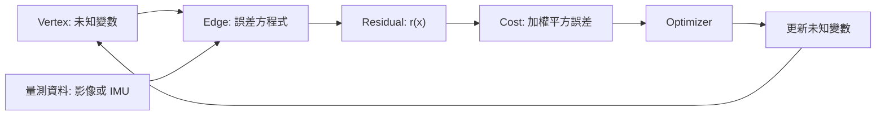
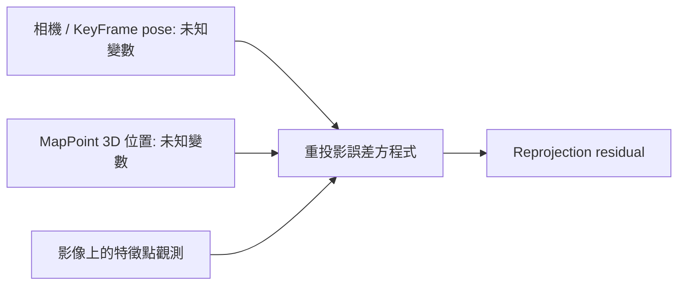
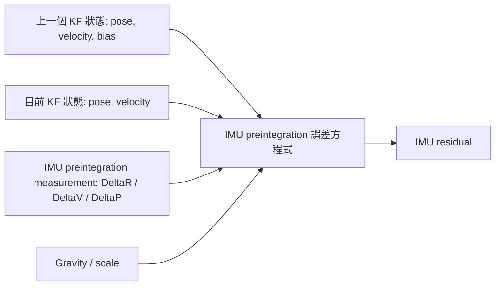
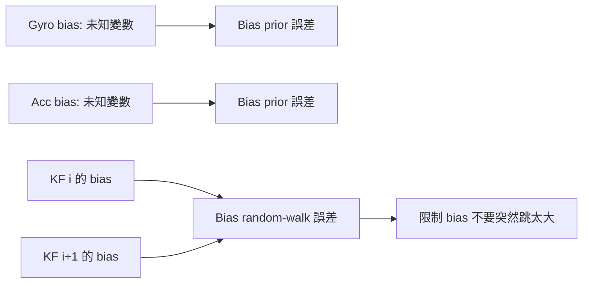
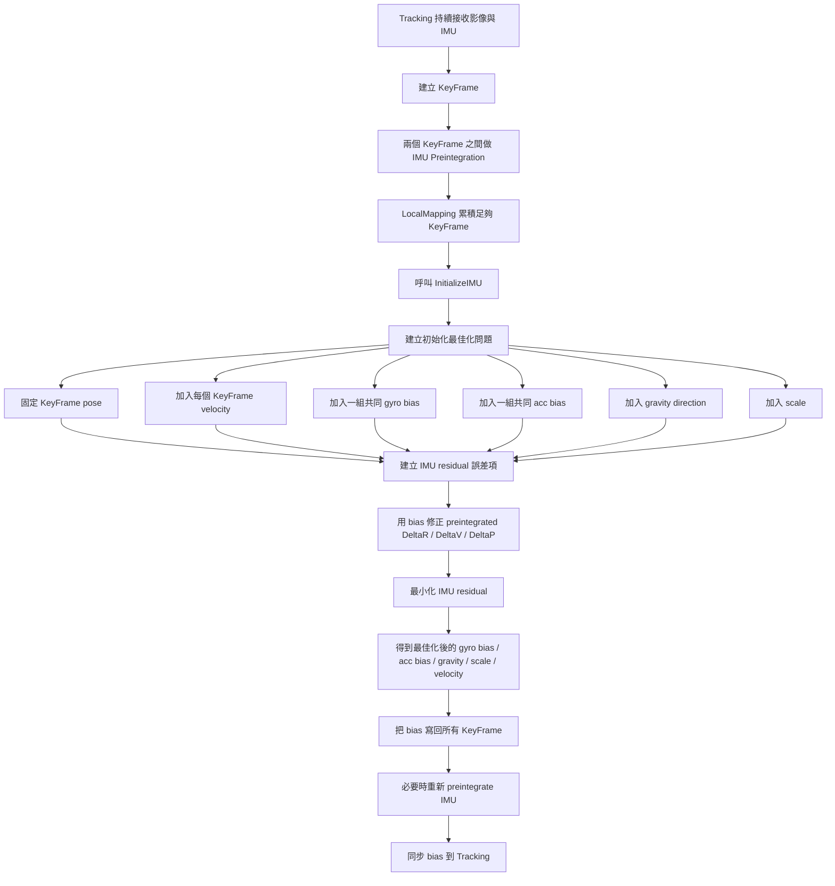
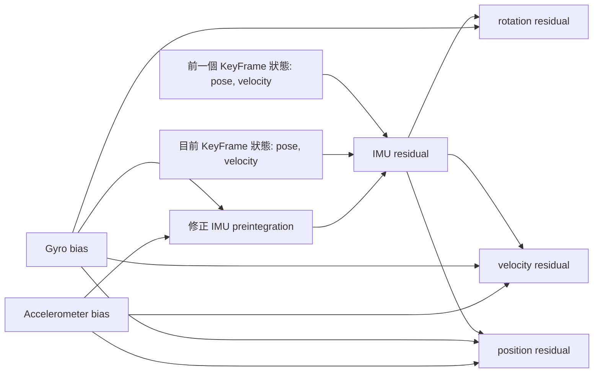
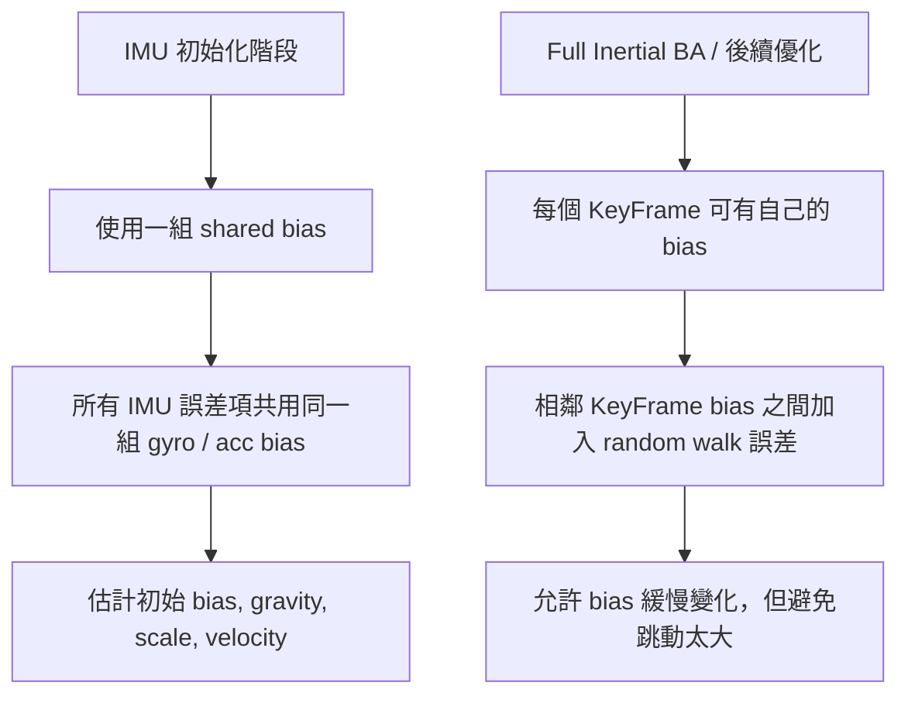

# IMU Bias 參與優化流程圖

## 1. 一句話結論

ORB-SLAM3 不是把 IMU bias 當成固定常數，而是把 gyro bias 和 accelerometer bias 放進最佳化問題中，和速度、重力方向、尺度一起被估計。初始化階段先估一組共同 bias，後續 Full Inertial BA / Tracking 再持續更新每個 KeyFrame 或 Frame 的 bias。

## 2. Vertex 和 Edge 是什麼

在 ORB-SLAM3 使用的非線性最小平方最佳化裡，可以先不要把 vertex / edge 想成抽象圖論。比較實際的說法是：

- **Vertex**：最佳化要求解的未知變數。
- **Edge**：一條誤差方程式，也就是 residual term。
- **Optimizer**：反覆調整未知變數，讓所有誤差項的加權平方和最小。

簡單講，vertex 是「我要解什麼」，edge 是「我用哪一條量測方程式檢查它合不合理」。



在 ORB-SLAM3 裡可以這樣對應：

| 類型 | 意義 | ORB-SLAM3 例子 |
| --- | --- | --- |
| Vertex | 待估未知變數 | camera pose、KeyFrame pose、MapPoint 位置、velocity、gyro bias、acc bias、scale、gravity direction |
| Edge | 誤差方程式 / residual term | reprojection error、IMU preintegration error、bias prior error、bias random-walk error |
| Measurement | 觀測資料 | feature pixel position、stereo depth、IMU preintegration、bias prior |
| Cost | 要最小化的加權誤差 | reprojection cost、IMU cost、bias drift cost |

更正式的說法：

```text
未知變數 x = 所有 vertex

最小化：

    sum over all residual terms:
        r_i(x)^T Omega_i r_i(x)
```

其中 `x` 是所有待估未知變數，`r_i(x)` 是第 i 條誤差方程式根據目前變數算出的 residual，`Omega_i` 是這條量測的資訊矩陣，也就是信任程度。ORB-SLAM3 / g2o 把未知變數叫 vertex，把誤差方程式叫 edge。

## 3. ORB-SLAM3 中常見的未知變數與誤差項

### 3.1 視覺重投影誤差



意思是：如果目前估計的相機位姿和 3D 地圖點是對的，把 3D 點投影回影像時，應該會落在觀測到的 feature 附近。

### 3.2 IMU preintegration 誤差



意思是：如果兩個 KeyFrame 的 pose、velocity、bias、gravity、scale 是合理的，那它們之間的運動應該和 IMU 預積分結果一致。

### 3.3 Bias prior 和 random walk 誤差



意思是：

- prior 誤差：初始化時給 bias 一個合理先驗，例如接近 0。
- random-walk 誤差：後續 BA 允許 bias 慢慢變，但不希望相鄰 KeyFrame 的 bias 突然差很多。

## 4. IMU 初始化中的 bias 優化流程



## 5. Bias 在 IMU residual 中的位置



重點：

- Gyro bias 會影響 rotation、velocity、position residual。
- Accelerometer bias 主要影響 velocity、position residual。
- 所以 bias 不是事後校正，而是直接參與最佳化的狀態變數。

## 6. 初始化與後續 BA 的差異



## 7. 適合口頭報告的說法

### 7.1 Vertex / Edge 版本

在 ORB-SLAM3 的非線性最小平方問題裡，vertex 可以理解成要求解的未知變數，例如相機位姿、地圖點、速度、IMU bias、尺度和重力方向。Edge 可以理解成一條誤差方程式，它會把量測資料和目前未知變數代進去，算出 residual。例如視覺的誤差方程式會算重投影誤差，IMU 的誤差方程式會算預積分運動和目前狀態預測之間的差。Optimizer 的工作就是調整這些未知變數，讓全部 residual 的加權平方和最小。

### 7.2 IMU Bias 版本

ORB-SLAM3 在 IMU 初始化時，會先把視覺估出的 KeyFrame pose 固定，然後利用 KeyFrame 之間的 IMU preintegration 建立慣性誤差項。這個最佳化問題裡，gyro bias 和 accelerometer bias 會被當成待估變數。每一條 IMU residual 都會使用目前估計的 bias 去修正預積分量，因此 bias 會直接影響旋轉、速度與位置誤差。最佳化完成後，系統會把估出的 bias 寫回 KeyFrame，並同步到 Tracking。後續 Full Inertial BA 則進一步把 bias 放入更完整的 visual-inertial 最小平方問題中，並用 random walk model 約束相鄰 KeyFrame 的 bias 變化。
